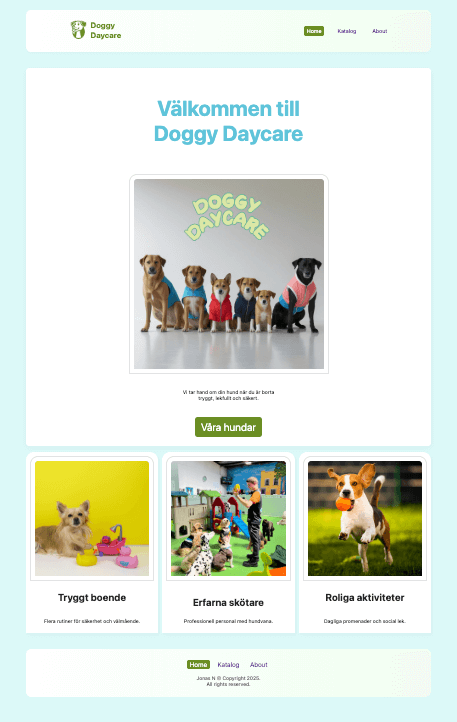
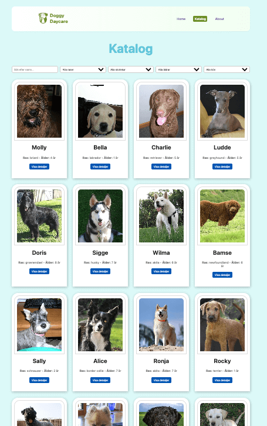
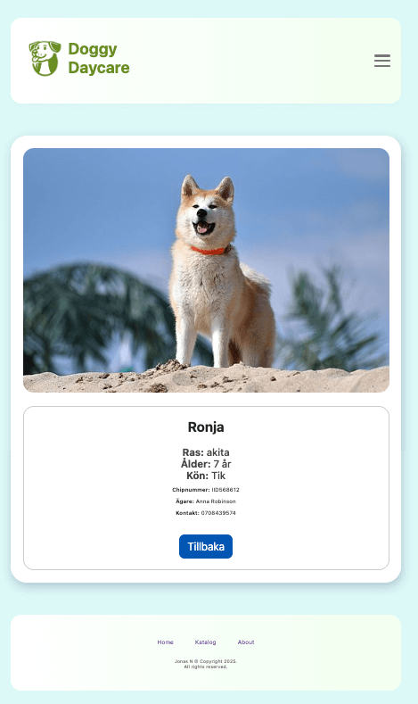

# 🐶 Doggy Daycare

A React application for a fictional dog daycare where you can explore dogs in a catalog, filter by different criteria, and view individual details.  
Live demo: [Doggy Daycare on GitHub Pages](https://jonasodiq.github.io/doggy-daycare/)

---

## 🚀 Features

- Home page with welcome text and business information  
- Catalog of dogs with filters (name, breed, size, age, sex)  
- Detail pages for each dog  
- About page with description and image  
- Dynamic data fetched from an external API  

---

## 🛠️ Tech Stack

- **React** (with React Router)  
- **Custom hooks** for data fetching and filtering  
- **CSS Modules** for component-based styling  
- **GitHub Pages** for deployment  

---

## 📦 Installation

To run the project locally:  

```bash
# Clone the repo
git clone https://github.com/jonasodiq/doggy-daycare.git

# Go into the folder
cd doggy-daycare

# Install dependencies
npm install

# Start development server
npm start
```

## 📸 Screenshots

### Home


### Catalog


### Dog detail


# License

This project is open source and free to use.
